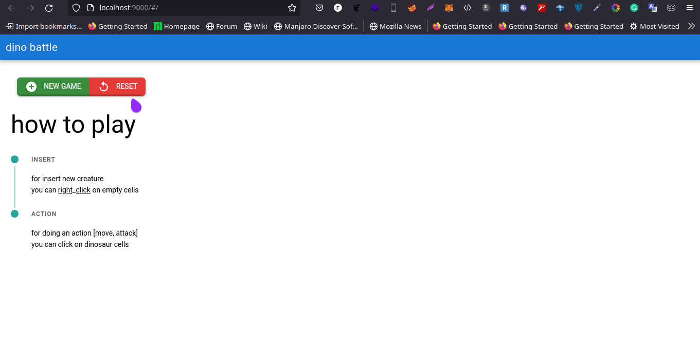

# dino battle (dino-battle)

dino battle



## Install the dependencies
```bash
# install npm and node js from here
https://docs.npmjs.com/downloading-and-installing-node-js-and-npm
# install quasar framework
npm i -g @quasar/cli
# you have to installed redis with redisearch extension
docker run -d --name redis-stack-server -p 6379:6379 redis/redis-stack-server:latest
#install python requirements 
pip install -r requrements
uvicorn main:app --reload
```

### Start the front end
```bash
cd dino_battle_front
quasar dev
```


### tests
```
test file is in the api folder
```
